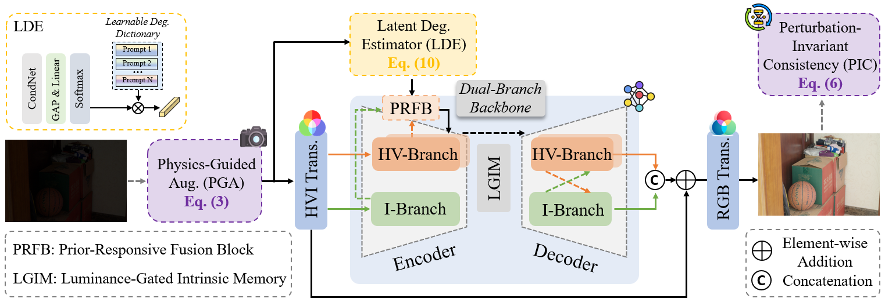

<div align="center">

# 🔦 InterLight: Leveraging Intrinsic Illumination Priors for Low-Light Image Enhancement (IJCAI'2026)

[](https://arxiv.org/abs/2605.19982)
[](LICENSE)
[](https://www.python.org/)
[](https://pytorch.org/)


</div>


This is the official PyTorch codes for the paper:

>**InterLight: Leveraging Intrinsic Illumination Priors for Low-Light Image Enhancement**<br> [Ziqi Wang<sup>1</sup>](https://scholar.google.com/citations?user=JMRxwuQAAAAJ&hl=zh-CN), [Xu Zhang<sup>1📧</sup>](https://house-yuyu.github.io/), [Laibin Chang<sup>1</sup>](https://scholar.google.com.hk/citations?user=1l8X8PgAAAAJ&hl=zh-CN&oi=ao), [Shi Chen<sup>2</sup>](https://scholar.google.com.hk/citations?user=4pj8flsAAAAJ&hl=zh-CN&oi=ao), [Jiaqi Ma<sup>3</sup>](https://leonmakise.github.io/), [Huan Zhang<sup>4</sup>](https://scholar.google.com.hk/citations?user=bJjd_kMAAAAJ&hl=zh-CN)<br>
> <sup>1</sup>Wuhan University <sup>2</sup>University of Macau <sup>3</sup>Mohamed bin Zayed University of Artificial
 Intelligence <sup>4</sup>Guangdong University of Technology<br>
> <sup>📧</sup> Corresponding author

## 🧠 Overview
we propose **InterLight**, a novel framework that systematically excavates and operationalizes intrinsic illumination priors for LLIE.



**Key Highlights:**
- 💡 **Intrinsic-Consistent Data Expansion:** simulates sensor-level illumination responses while preserving structural fidelity.
- 🧩 **Adaptive Degradation Prior Generation:** extracts sample-specific degradation prior through a learnable degradation dictionary.
- ⚙️ **Luminance-Gated Intrinsic Memory:** retrieves learned structural and textural patterns to compensate for information loss.
## ⚡ Start

### prepare dataset

- [LOLv1](https://daooshee.github.io/BMVC2018website/)
- [LOLv2](https://pan.baidu.com/s/17KTa-6GUUW22Q49D5DhhWw?pwd=yixu) (code: `yixu`) and  [One Drive](https://1drv.ms/u/c/2985db836826d183/EYPRJmiD24UggCmCAQAAAAABEbg62rx0FG21FwLQq0jzLg?e=Im12UA) (code: `yixu`) 
- [SICE](https://pan.baidu.com/s/13ghnpTBfDli3mAzE3vnwHg?pwd=yixu) (code: `yixu`) and [One Drive](https://1drv.ms/u/s!AoPRJmiD24UphAlaTIekdMLwLZnA?e=WxrfOa) (code: `yixu`)
- [Sony-Total-Dark(SID)](https://pan.baidu.com/s/1mpbwVscbAfQJtkrrzBzJng?pwd=yixu) (code: `yixu`) and [One Drive](https://1drv.ms/u/s!AoPRJmiD24UphAie9l0DuMN20PB7?e=Zc5DcA) (code: `yixu`)
- [LSRW-Huawei](https://github.com/JianghaiSCU/R2RNet)
### pretrained weights

We provide pretrained weights for the main evaluation settings, including **LOLv1**, **LOLv2-Synthetic**, and **LOLv2-Real**.

| Dataset | Weight |
| --- | --- |
| LOLv1 | Included in `save` |
| LOLv2-Synthetic | Included in `save` |
| LOLv2-Real | Included in `save` |

Download link:

- Baidu Netdisk: [save](https://pan.baidu.com/s/1AfgQQYEp0gGIxEEsVwfMCw?pwd=8686)
- Extraction code: `8686`

After downloading, please place the `save` folder under the project root directory:

```text
InterLight/
├── assets/
├── save/
│   ├── lolv1/
│   ├── lolv2_syn/
│   └── lolv2_real/
├── README.md
└── ...
```
## :postbox: Contact

If you have any questions, please feel free to reach us out at <a href="zhangx0802@whu.edu.cn">zhangx0802@whu.edu.cn</a>.

